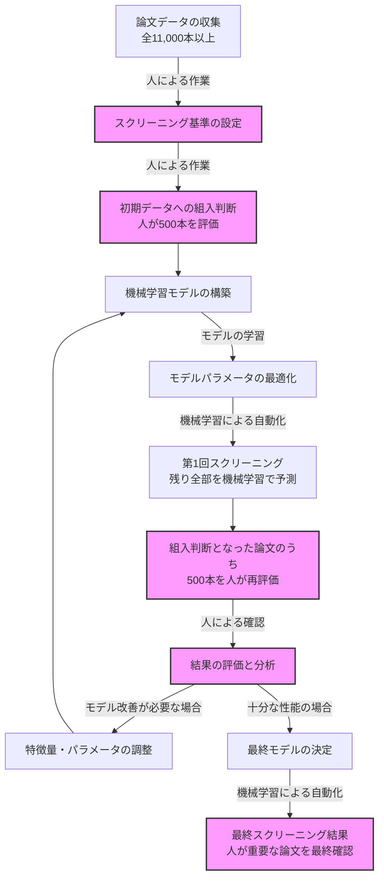

# 論文スクリーニング自動化プロジェクト

## プロジェクト概要
このリポジトリは、論文スクリーニングの自動化を目的としています。特に輸血と感染症の関連に関する研究論文を効率的に選別するためのツールを提供します。機械学習を活用することで、大量の論文から研究テーマに関連する論文を効率よく抽出し、研究者の作業負担を軽減します。

## リポジトリの構成
- `abstract_screener.ipynb`: 論文要旨のスクリーニングを行うための機械学習モデル構築用ノートブック
- `*.csv`: 論文データと評価結果のCSVファイル
- `model_data.joblib`: 学習済み機械学習モデル
- `model_params.json`: モデルのパラメータ設定
- `R/`: メタ分析実行用のRスクリプトと関連データ

## 使用している技術
このプロジェクトでは、テキスト分類のための機械学習技術を使用しています。専門的な言葉を使わずに説明すると：

1. **テキスト分析**: 論文のタイトルと要旨から重要な特徴を自動的に抽出します
2. **機械学習**: 人間の判断を学習して、新しい論文が研究テーマに関連するかどうかを予測します
3. **最適化**: より精度の高い判断ができるよう、モデルの設定を調整します

論文を「含める」か「除外する」かの判断を自動化することで、数万件の論文から重要なものを効率よく見つけ出します。

## 使い方
1. Jupyter Notebookを実行環境にインストール
2. `abstract_screener.ipynb`を開く
3. 手順に従って論文データを準備し、モデルを実行
4. スクリーニング結果を確認し、必要に応じて調整

## 人と機械学習の協働プロセス

以下のフローチャートは、機械学習と人間がどのように協力して論文スクリーニングを行うかを示しています：

*ピンク色のボックスは人が主に関わるステップを示しています*

## 技術的なポイント
- **作業効率の向上**: 人手だけでは週単位かかる作業を、機械学習を使って数時間に短縮
- **評価プロセス**:
  - 人による初期評価：最初の500本を人間が判断
  - 機械学習モデルのトレーニング：人間の判断パターンを学習
  - 残りの論文を機械学習で一括スクリーニング
  - 組入判断となった論文から500本を選び、人間が再評価して精度を確認
- **モデルの性能**:
  - 感度（関連論文の取りこぼしを防ぐ能力）重視の設計
  - LightGBMという高速な機械学習アルゴリズムを使用
  - ハイパーパラメータ最適化による精度向上
